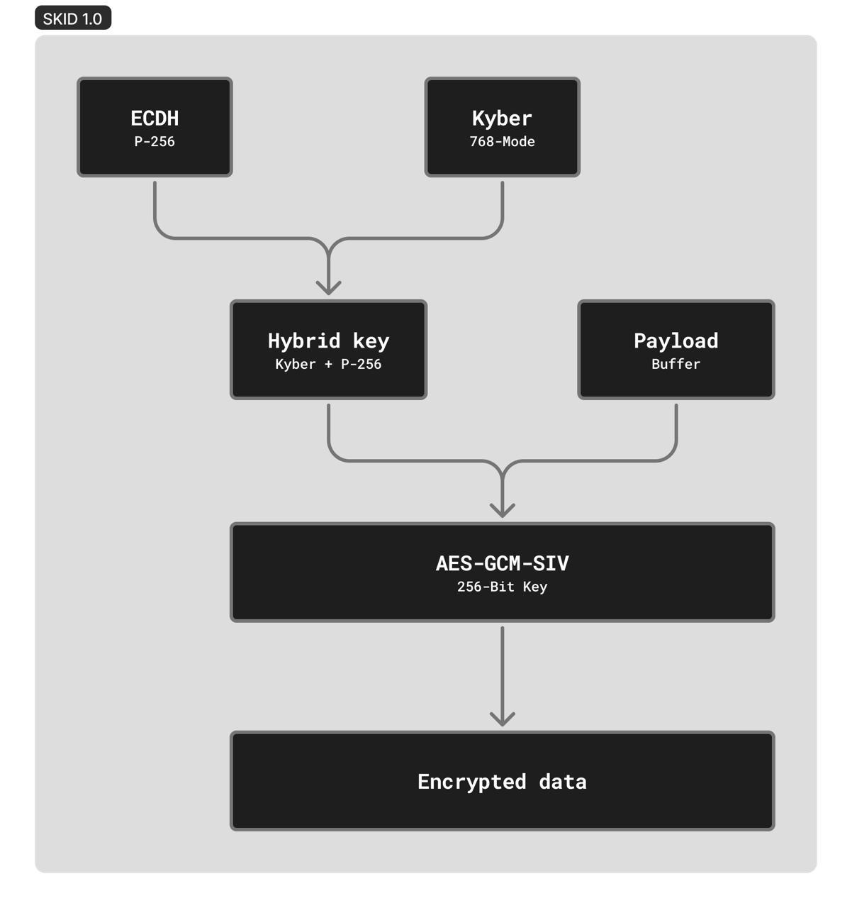

# skid

    
    
SKID 1.0

SKID consists of a hybrid of classical ECDH using the P-256 curve and the post-quantum Kyber-768. A single session key, used to encrypt your messages, is derived through HKDF.

Messages are encrypted using AES-256 GCM SIV. They are signed with Ed25519, covering the ciphertext, IV, wrapped keys, and auxiliary metadata, protecting against message tampering.

Each of your messages is encrypted on your device. The server only receives the already-encrypted message, which can be decrypted only by you and your conversation partner.